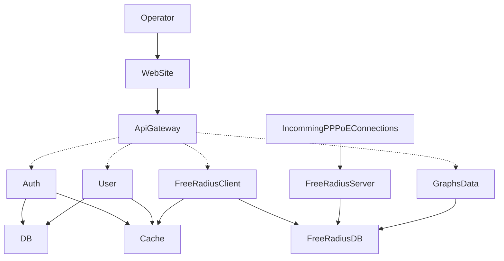
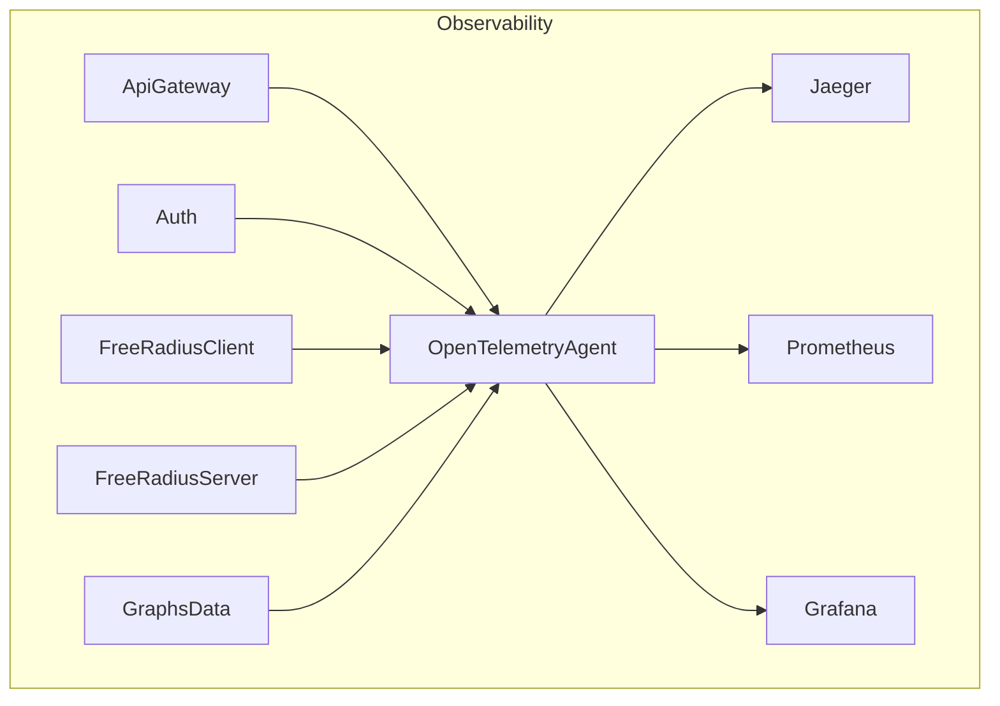

# RadiusX

This project focuses on implementing an AAA (Authentication, Authorization, and Accounting) management system specifically designed to authenticate **PPPoE connections for Mikrotik devices**, using a microservices architecture. The system ensures scalability, traceability, and robustness in managing users and services.

## Key Features

- **API Gateway as an orchestrator**:  
  Handles HTTP requests and translates them into gRPC calls, coordinating interactions between microservices.

- **Centralized management with FreeRADIUS**:  
  A dedicated client performs CRUD operations on users and profiles in the FreeRADIUS database, supporting PPPoE authentication.

- **Monitoring and traceability**:  
  Leveraging **OpenTelemetry** for distributed request tracing and real-time observability.

- **Integration with RouterOS**:  
  Seamless communication between FreeRADIUS and Mikrotik devices for efficient PPPoE user authentication and management.

- **Service-oriented architecture**:  
  Each component fulfills a specific responsibility, ensuring modularity and ease of maintenance.

## Technologies Used

- **Main language**: Golang  
- **Communication protocol**: gRPC  
- **Authentication**: FreeRADIUS  
- **Monitoring**: OpenTelemetry  

## Observability

